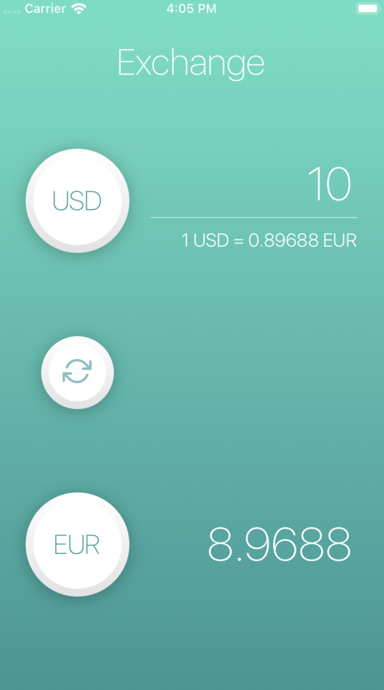
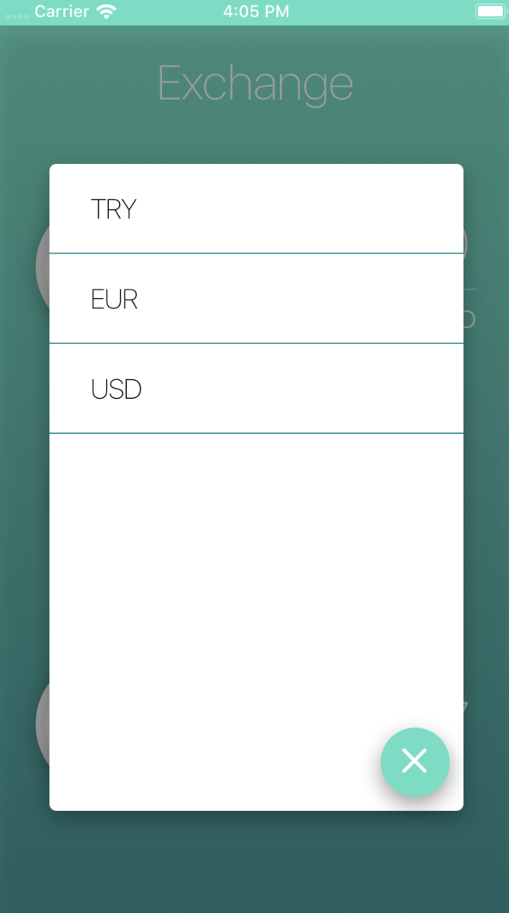

# Exchangedroid 🤑📱

Exchangedroid is a simple mobile app to exchange between different currencies written in React Native.

## Screenshots

    
    

## Development 👩🏻‍💻👨🏻‍💻

Please sure that you have below environments

- Node JS >= 10.15.3
- NPM >= 6.13.1
- Yarn >= 1.16.0 (Recommended)

### For iOS

- Xcode 11.1

## Setup ⚙️

Install node packages;

`yarn install`

#### For iOS

Install Pods

`cd ios`

and run

`pod install`

go back

`cd ..`

`react native run-ios`

### For Android

Make sure that you have a running android emulator

run

`react-native run-android`
